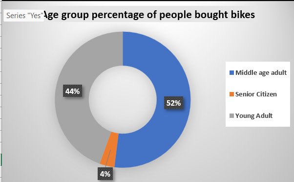
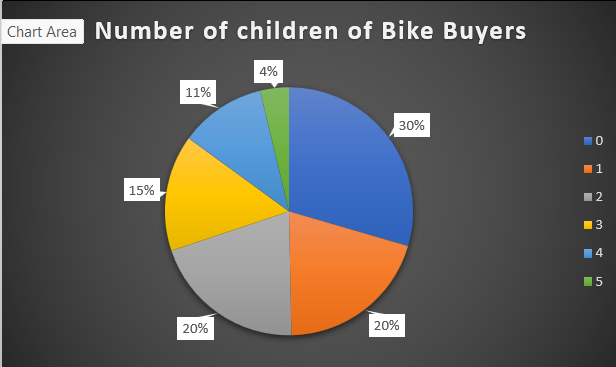
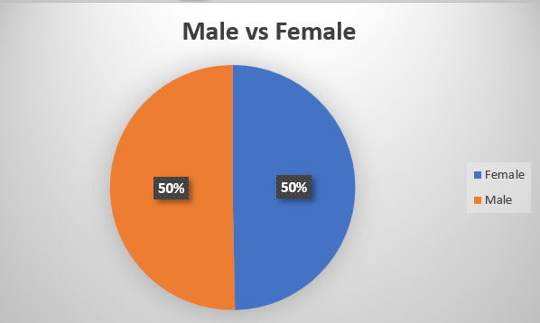
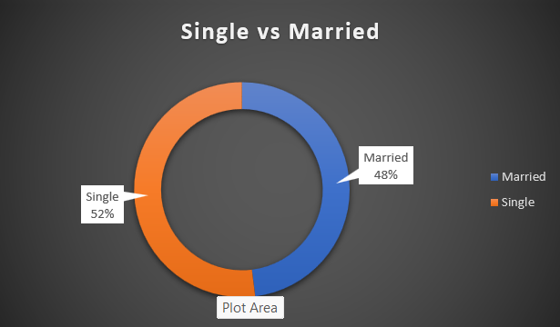
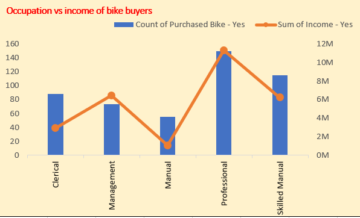

# Bike Buyers Analysis

An end-to-end data analytics project using Microsoft Excel to analyze consumer demographic profiles. This repository serves as a live, evolving log of my progress as I transform raw transactional data into structured business insights.

## Repository Files
* `Raw Data.xlsx`: The original, unformatted dataset containing abbreviations and duplicate records.
* `Cleaned Data.xlsx`: The finalized, deduplicated, and formatted dataset ready for analysis.

---

## Phase 1: Data Cleaning & Quality Assurance
Before moving into analytical modeling, I executed a strict data cleaning workflow to ensure data integrity:

1. **Table Structuring & Alignment:** Standardized the visual layout and text alignment across the entire dataset for readability.
2. **Deduplication:** Identified and removed duplicate rows to eliminate redundant customer records.
3. **Data Auditing via AutoFilter (`Ctrl + Shift + L`):** Utilized Excel's filter tools to review all unique categorical values, checking for anomalies, missing entries, or formatting discrepancies.
4. **Data Standardization (Text Expansion):**
   * Converted single-letter marital abbreviations (`M` / `S`) to fully qualified terms (`Married` / `Single`).
   * Expanded gender tags (`M` / `F`) into professional categories (`Male` / `Female`).

---

## Phase 2: Data Transformation & Feature Engineering
To prepare the dataset for deeper Pivot Table analysis and visualization, I completed:
* **Dynamic Age Segmentation:** Implemented a nested `IF` logical formula to group individual customer ages into business-focused demographic buckets (`Young Adult`, `Middle age adult`, etc.).

---

## Phase 2.5: Advanced Corporate Querying & Logical Auditing
To prepare for professional Data Analyst technical evaluations, I built an analytical verification bench within the workbook. This section validates data integrity and handles multi-criteria filtering using advanced Excel functions instead of standard pivot filters.

### Core Analytical Logic Implemented:
* **Dynamic Record Extractions (`XLOOKUP`):** Engineered exact-match arrays to query structural indices (like `Customer ID`) and fetch nested financial variables directly, overriding traditional left-to-right column constraints.
* **Intersection Demographics Counting (`COUNTIFS`):** Formulated cross-categorical matrices to count specific overlapping segments (e.g., isolating customers who are concurrently `Married` AND managing exactly `2 children`).
* **Categorical Financial Aggregations (`SUMIFS`):** Wrote synchronized criteria aggregations to isolate and sum large-scale transactional metrics based on strict department titles (e.g., compounding total revenue generated solely by the `Professional` occupational sector).
* **Nested Conditional Lookups (`IF + XLOOKUP`):** Combined logical conditions with nested lookups to audit back-end database flags (like `Home Owner` status) and automatically output tailored compliance strings (`Confirmed Owner` vs. `Renter`).

### Formula Execution Reference
The execution and exact logic of these queries are logged in the verification tab below:

*All formulas are live and testable inside the main spreadsheet file.*

---

## Tech Stack
* **Tool:** Microsoft Excel (AutoFilter Auditing, Advanced Lookups, Multi-Criteria Conditional Aggregations, Nested Logical Formulas, Text Standardization, Data Deduplication, Pivot Charts)

---

## Phase 3: Data Visualizations & Key Insights
To uncover purchasing trends, I built targeted Pivot Charts to segment our buyers. 

### Insight 1: Age Demographics vs. Bike Ownership
By implementing dynamic age segmentation, the data reveals that the primary customer base is concentrated heavily in core working-age demographics:
* **Middle-aged Adults** represent the highest conversion group at **52%**.
* **Young Adults** follow closely behind at **44%**.
* **Senior Citizens** make up the smallest consumer segment at just **4%**.

*Business Recommendation: Marketing campaigns should heavily target young and middle-aged working professionals.*

### Insight 2: Household Size & Children Demographics
Segmenting bike buyers by the number of children in their households reveals a strong concentration among smaller family structures:
* **30%** of buyers have **0 children**.
* **40%** of buyers have a small family unit with **1 to 2 children** (split equally at 20% each).
* Large families represent a clear minority, with households of 5 children contributing just **4%** of total purchases.

*Business Recommendation: Company should focus more on families with 2 or less than 2 children*

### Insight 3: Gender Segmentation (Male vs. Female)
An analysis of buyer gender identity reveals a perfectly symmetrical split across the consumer base:
* **Females** account for exactly **50%** of total bike purchases.
* **Males** account for exactly **50%** of total bike purchases.

*Business Recommendation: The product holds perfect gender neutrality. Which is a huge plus for company and company should maintain it*

### Insight 4: Marital Status Breakdown (Single vs. Married)
Segmenting the consumer base by relationship status shows an incredibly balanced distribution, indicating strong product appeal across multiple lifestyle segments:
* **Single** buyers represent **52%** of total bike purchases.
* **Married** buyers represent **48%** of total bike purchases.

*Business Recommendation: Run ads showing single people commuting to work or college, and separate ads showing married couples riding together on weekends.*

### Insight 5: Occupation vs. Income of Bike Buyers
Analyzing buyers by their job types and total income reveals which professional segments generate the most business:
* **Professionals** are our largest market, buying nearly 150 bikes and contributing the highest total income.
* **Skilled Manual** workers follow as the second-largest buying group.
* **Manual** laborers represent the smallest segment, with both the lowest bike count and lowest total income.

*Business Recommendation: Target premium, high-end bikes at Professionals and Management, while offering budget-friendly, durable commuter models for Manual and Clerical workers.*
